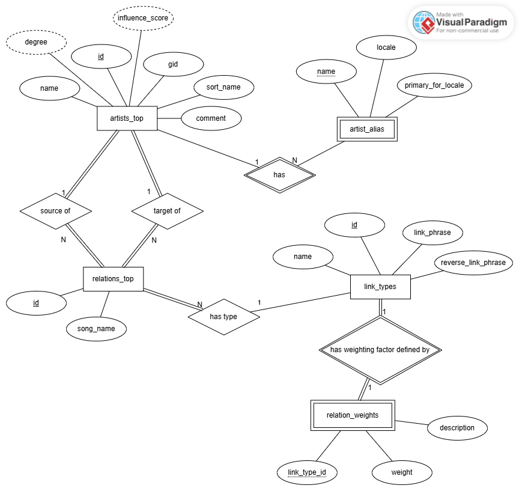
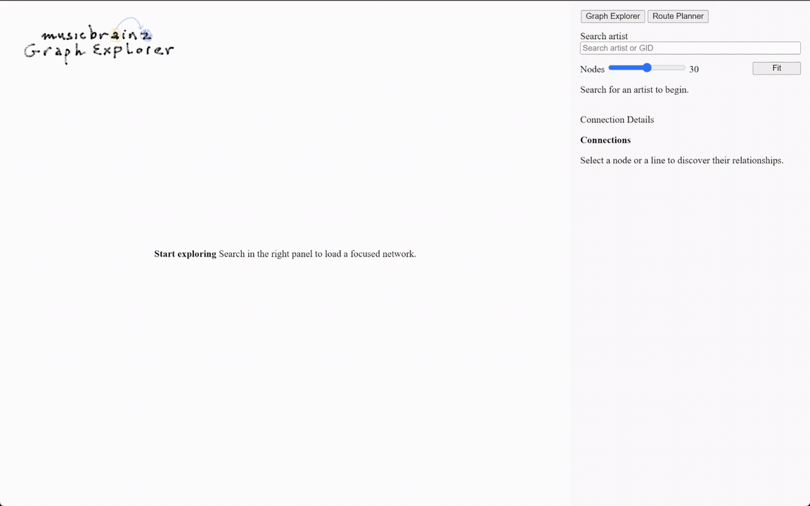
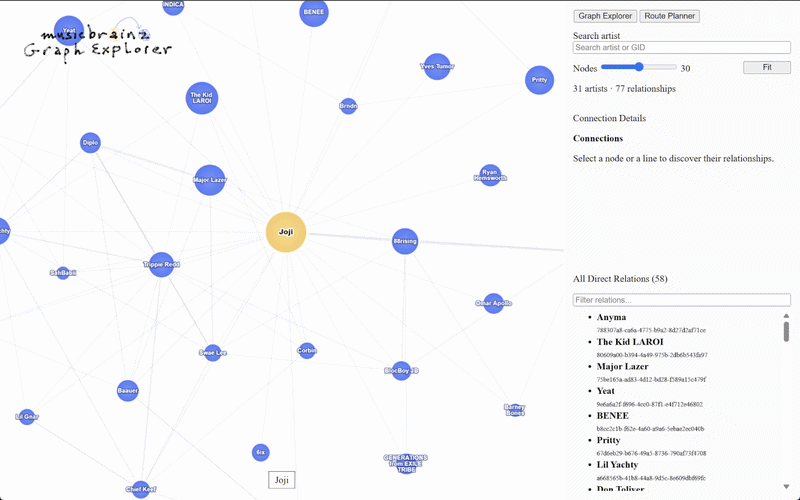
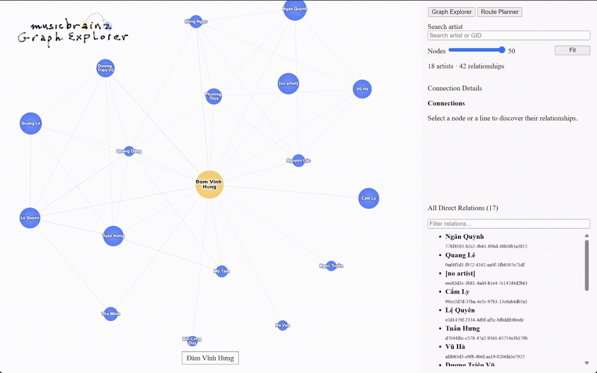
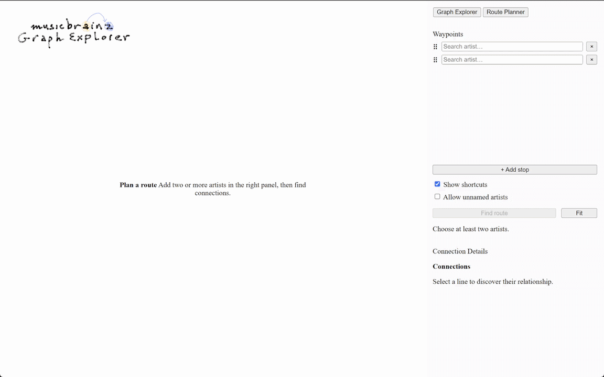

# MusicBrainz Graph Explorer

A web application for exploring the network of relationships between music artists, using data from the MusicBrainz Database.

  

## Features

- Search for artists by name – supports non-diacritic and multilingual input
- Display a graph showing first-degree and all internal relationships with drag-and-drop interaction
- View detailed relationship information between two artists (relationship type, collaborative songs)
- Find paths between two or more artists

## Tech Stack

- **Backend:** Flask, NetworkX, psycopg2
- **Database:** PostgreSQL
- **Frontend:** Cytoscape.js, JavaScript
- **Data source:** MusicBrainz Database Dump

## Database Schema

  

## System requirements

- Python 3.11+
- PostgreSQL 14+

## Demo

- Search for an artist

  

- Adjust the number of artists on the graph

  

- Display information about the relationships between two artists.

  

- Display the next artist and return to the previous artist.

  

- Find connecting paths between multiple artists.

  

## License

This project is licensed under the MIT License — see the [LICENSE](LICENSE) file for details.

## Data Attribution

Data from [MusicBrainz](https://musicbrainz.org) (CC0).